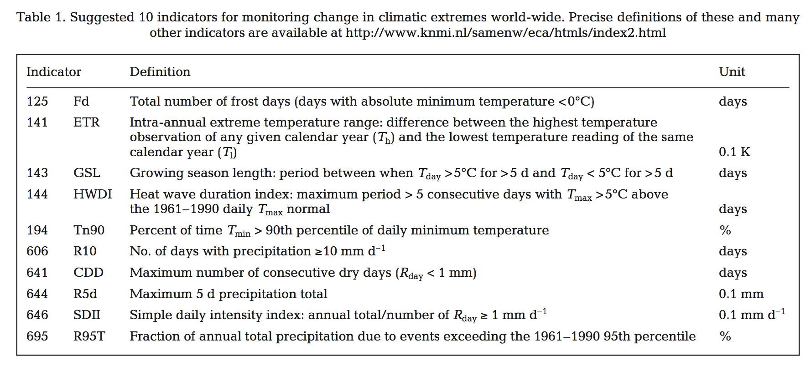

# Data Course 2018

## Background
Collection of all R functions to calculate the indices from the paper: 

**Frich et al. (2002):** Observed Coherent Changes in Climatic Extremes During the Second Half of the Twentieth Century, Climate Research, 19(3): 193–212. 
 * Journal: <http://www.int-res.com/abstracts/cr/v19/n3/p193-212/#> 
 * PDF: <http://www.int-res.com/articles/cr2002/19/c019p193.pdf>

Set of indices to cover manifold aspects of changing climate. To calculate the indices, rainfall and temperature date is needed. Daily values are suggested. Temperature data should cover daily minimum, mean and maximum temperature (`Tmin`, `Tmean`and `Tmax`).




## Instructions ##
Develope a robust and comprehensive function in R to calculate the particular index. Insert a comment block in the code with a few lines to describe the functionality and how the index is calculated.
Name your R-File according to the index, e.g. _Fd.R_, _ETR.R_, _Tn90.R_ etc.
At the end, submit your code snippet via e-mail.
---


---
## Example function

Here’s some code, ```id``` represents the station id in Baden-Württemberg.
```{r}
> df %>% sample_n(., 8)
# A tibble: 8 x 9
     id       date   RSK  RSKF SHK_TAG   TNK   TMK   TXK   UPM
  <int>     <date> <dbl> <int>   <int> <dbl> <dbl> <dbl> <int>
1  1443 2002-02-03   0.0     0       0   4.4  10.0  18.0    59
2  5229 1954-10-08   0.4     1       0   1.4   3.2   6.5    85
3  1197 1989-05-13   3.9     6       0   6.4  10.1  15.1    81
4  1468 2001-01-02  12.9     6      10   0.9   2.9   6.3    93
5   259 1971-03-24   0.0     0       0  -2.4   6.0  10.2    54
6  4931 1957-01-07   0.0     0       0   1.1   2.9   7.7    79
7  2814 2005-04-28   0.1     6       0   3.5  10.6  16.3    68
8  4300 2007-04-24   0.0     0       0   6.9  14.6  23.7    59
```


```
> df %>% select(id, date, rain=RSK, temp=TMK) %>% sample_n(.,10)
# A tibble: 10 x 4
      id       date  rain  temp
   <int>     <date> <dbl> <dbl>
 1  2638 2008-01-29   0.0   3.1
 2  1602 1998-04-25   7.7  14.4
 3   259 1983-09-20   0.0  12.9
 4  5731 1990-07-11   0.0  16.3
 5  5664 2016-05-08   0.0  17.0
 6  4887 1949-08-02  10.7  23.2
 7   259 2010-03-16   0.3   6.2
 8  3761 1957-10-16   0.8  11.0
 9  1197 1988-08-12   9.6  18.8
10  5664 1979-08-27   0.0  11.0
```

## Hints
...
